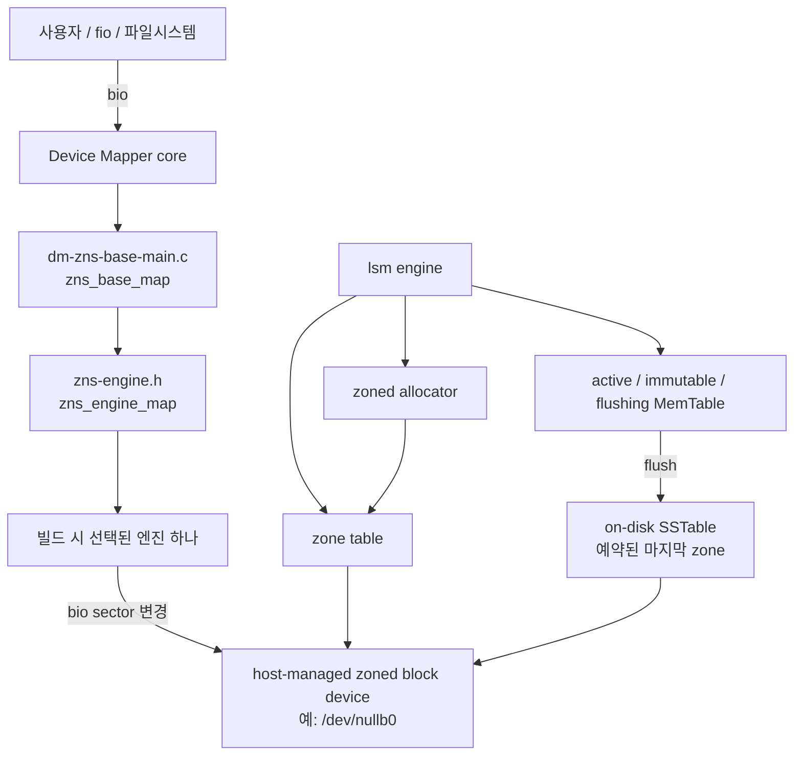

# 09. 코드 가이드

이 문서는 현재 코드베이스를 읽기 위한 출발점이다. 세부 내용은 아래 세 문서로 나누었다.

| 문서 | 다루는 내용 |
|---|---|
| [10-components](10-components.md) | Device Mapper 진입점, 엔진 인터페이스, zone table, allocator, MemTable의 책임과 연결 관계 |
| [11-engines](11-engines.md) | `append4k`, `append4k-alloc`, `lsm`의 I/O 전략과 차이 |
| [12-tests](12-tests.md) | 각 단위·통합·인수 테스트가 만드는 환경, 자극하는 경로, 판정하는 결과 |

## 한눈에 보는 데이터 경로



상위 `/dev/mapper/<name>`은 conventional 블록 장치로 보인다. 현재 [`target_type`](../src/dm-zns-base-main.c#L84-L91)에 zoned feature와 `report_zones` 콜백이 없기 때문이다. 반면 엔진은 하위 host-managed 장치의 write pointer를 지키며 물리 쓰기 위치를 정해야 한다.

핵심 흐름은 다음과 같다.

1. `dmsetup create`가 [`zns_base_ctr()`](../src/dm-zns-base-main.c#L20-L65)를 호출한다.
2. 공통 계층이 하위 장치를 열고 선택된 엔진의 [`zns_engine_init()`](../src/zns-engine.h#L15-L18)을 호출한다.
3. 들어오는 bio는 [`zns_base_map()`](../src/dm-zns-base-main.c#L77-L82)에서 엔진의 `zns_engine_map()`으로 그대로 전달된다.
4. 엔진은 논리 sector를 새 물리 sector로 바꾸어 `DM_MAPIO_REMAPPED`를 반환하거나, 직접 I/O를 처리하고 `DM_MAPIO_SUBMITTED`를 반환한다.
5. DM 장치 제거 시 [`zns_base_dtr()`](../src/dm-zns-base-main.c#L67-L75)가 엔진 상태와 하위 장치 참조를 해제한다.

## 가장 먼저 알아둘 제약

- 기본 논리 블록은 [`ZNS_BASE_BLOCK_SECTORS = 8`](../src/zns-engine.h#L9), 즉 512-byte sector 기준 4 KiB다.
- 공통 계층은 [`dm_set_target_max_io_len(..., 8)`](../src/dm-zns-base-main.c#L51-L58)로 큰 bio가 최대 4 KiB 조각으로 들어오도록 제한한다.
- `append4k`와 `append4k-alloc`은 정렬된 4 KiB 요청만 처리한다. `lsm`은 sector 정렬 요청을 4 KiB mapping 단위 RMW로 처리한다.
- `lsm` 엔진은 얼어붙은 MemTable을 예약 zone에 SSTable로 flush하고 정상 종료 뒤 복구한다. 비정상 종료 때 아직 MemTable에만 있던 mapping은 WAL이 없어 유실될 수 있다. 나머지 엔진의 mapping은 전부 메모리에만 있다.
- 현재 allocator는 끝까지 append한 뒤 `-ENOSPC`를 반환한다. invalid block 회수, victim 선정, zone reset을 포함한 GC는 없다.
- 공통 계층은 DM의 논리 길이와 하위 장치의 물리 길이를 따로 전달한다. `lsm` target 길이는 metadata zone을 제외한 block-addressable data capacity 이하여야 하며 더 작게 잡아 over-provisioning 영역을 남길 수 있다.

## 엔진 선택

[`src/Makefile`](../src/Makefile#L1-L5)은 `ZNS_ENGINE` 이름에 해당하는 `engines/zns-engine-<name>.c` 하나를 링크한다.

```bash
make -C src clean
make -C src ZNS_ENGINE=lsm
```

기본값은 `lsm`이다. 선택은 런타임 dispatch가 아니므로 한 `.ko` 안에 여러 엔진이 동시에 들어가지 않는다. 자세한 비교는 [엔진 문서](11-engines.md)를 참고한다.

## 추천 읽기 순서

1. [`zns-engine.h`](../src/zns-engine.h)에서 엔진 계약 확인
2. [`dm-zns-base-main.c`](../src/dm-zns-base-main.c)에서 생성·map·해제 흐름 확인
3. [`zns-engine-append4k.c`](../src/engines/zns-engine-append4k.c)에서 가장 단순한 변환 확인
4. [`zns-zone.c`](../src/zns-zone.c)와 [`zns-allocator.c`](../src/zns-allocator.c)에서 zoned 배치 확인
5. [`lsm-memtable.c`](../src/lsm-memtable.c), [`lsm-sstable.c`](../src/lsm-sstable.c), [`lsm-super.c`](../src/lsm-super.c), [`zns-engine-lsm.c`](../src/engines/zns-engine-lsm.c)에서 현재 M1 구현 확인
6. [테스트 문서](12-tests.md)에서 각 동작이 어떤 방식으로 검증되는지 확인
