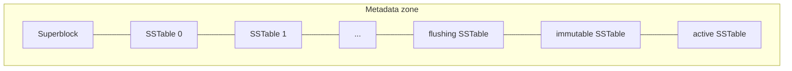

# 졸업프로젝트 월간 보고서 (8월)

> *이동혁(2021086917)*

> *최현준(2021037401)*

## 요약

7월에는 메모리 상의 (논리적 주소 → 물리적 주소) 매핑 테이블을 구성하였다. 이를 통해 임의의 블록 주소에 대한 쓰기 요청을 순차 쓰기로 변환할 수 있었다. 하지만 아래 두 가지 문제가 있었다

1. 메모리 상에 저장되므로 메모리 효율이 떨어짐.
2. 메모리 상에 저장되므로 종료 시 매핑 정보가 소실됨.

8월에는 위 두 문제를 해결하고자, SSTable을 통한 Memtable 영속화 기능을 아래와 같이 도입하였다.

- Memtable 크기가 임계치 이상으로 커지면 SSTable로 변환하여 디스크에 저장한다.
- 정상 종료 후 다시 시작할 때는 SSTable을 읽어 매핑 정보를 로드한다.
- 매핑 정보를 조회할 때는 Memtable부터 읽은 뒤 SSTable을 함께 조회한다.

## 1. 개발 목표

ZNS zone에서는 다음 쓰기 위치인 write pointer부터 순서대로 기록해야 한다. 따라서 같은 logical block을 덮어쓸 때도 기존 physical sector를 수정하지 않고, 새로운 위치에 데이터를 쓴 뒤 다음 매핑을 갱신한다.

```text
logical block → physical sector
```

기존 엔진은 이 매핑을 MemTable에만 보관하였다. Target을 제거하면 실제 데이터는 장치에 남아 있어도 그 위치를 찾을 매핑이 사라졌고, 모든 매핑을 계속 메모리에 유지해야 했다.

이번 달의 주요 목표는 다음과 같다.

- Memtable 영속화
  - MemTable의 매핑을 ZNS 장치에 저장
  - 정상 종료 시 Memtable 저장
  - 재시작 시 기존 매핑 복구
- SSTable Read
  - 매핑 조회 시 Memtable → SSTable 순서로 조회

## 2. 설계 및 구현
### 2.1 Metadata zone과 SSTable
ZNS device의 마지막 zone 하나를 metadata 전용으로 예약하였다. 이 공간에 SSTable과 각종 메타데이터(superblock)을 저장한다.
```text
ZNS device
├── data zones: 실제 데이터
└── metadata zone
    ├── superblock
    ├── SSTable 0
    ├── SSTable 1
    └── ...
```

MemTable의 매핑은 logical block 순서로 정렬된 후 SSTable로 저장된다. 새 SSTable은 metadata zone의 write pointer에 추가하며, 이미 기록된 SSTable은 수정하지 않는다. 같은 logical block의 매핑이 여러 SSTable에 있으면 가장 최근 SSTable의 값을 사용한다.

SSTable의 header에는 entry 수, 저장 block 수, logical block 범위와 생성 순서를 기록한다. Payload에는 `logical block → physical sector` 매핑을 저장한다. 이 정보만으로 필요한 SSTable을 좁히고 내부의 정렬된 매핑을 탐색할 수 있다.

Metadata zone을 예약해도 상위 Device Mapper 장치가 노출하는 논리 주소 범위는 바뀌지 않는다. 다만 하위 장치에서 실제 data allocation에 사용할 수 있는 공간은 zone 하나만큼 감소한다.

### 2.2 MemTable flush

매핑은 다음 과정을 거쳐 영속화된다.

```text
active MemTable
→ immutable MemTable
→ flushing MemTable
→ SSTable
```


#### active
새로운 Write 요청이 들어올 때마다 `active` memtable에 매핑이 실시간으로 추가된다.

 `active` 에 일정 수(임계값)를 넘어서는 매핑이 쌓이면 더 이상 변경되지 않는 `immutable` 상태로 전환하고, 새로운  `active` Memtable을 생성한다.

#### immutable

`immutable` 상태에서는 더이상 Memtable이 수정되지 않는다. Flush가 시작될 때 `flushing` 상태로 전환된다.

이러한 중간 상태를 둔 이유는, Flush 스레드와의 Lock 경합 병목을 최소화하기 위함이다. 만약 `immutable`이 `flushing`으로 전환되기 전에, 새로운 `active`에도 일정 수를 넘어가는 매핑이 쌓이면 `immutable`에 `active`의 매핑 정보를 병합한다.
#### flushing

기록 중인 MemTable은 `flushing` 상태로 전환한다.

Flush(Memtable → SSTable)가 성공하면 새로 추가된 SSTable을 매핑 정보 목록에 등록한 뒤 flushing MemTable을 해제한다. 이를 통해 매핑 정보가 일시적으로 소실되는 문제를 방지한다.

Flush가 실패하면 MemTable을 flushing 상태에 남겨 기존 매핑을 계속 읽을 수 있게 한다. 실패 전에 실제 기록되어 write pointer가 전진한 공간은 다시 사용하지 않는다.

## 3. 최신 매핑 조회

영속화 이후에는 매핑이 메모리와 디스크 중 어느 곳에든 존재할 수 있다. 따라서 읽기는 다음 순서로 매핑을 찾는다.

```text
Read 요청
  │
  ▼
Active MemTable 조회 ── 매핑 존재 ──> Read
  │
  │ 매핑 없음
  ▼
Immutable MemTable 조회 ── 매핑 존재 ──> Read
  │
  │ 매핑 없음
  ▼
Flushing MemTable 조회 ── 매핑 존재 ──> Read
  │
  │ 매핑 없음
  ▼
SSTable 최신순 조회 ── 매핑 존재 ──> Read
  │
  │ 매핑 없음
  ▼
zero-fill 응답 반환
```

최근 세대부터 확인하므로 같은 logical block이 여러 위치에 존재해도 마지막 write의 physical sector를 선택한다. MemTable에서 찾지 못한 경우에만 metadata zone의 SSTable을 조회한다.

이 순서는 flush 전, flush 중, flush 후에 매핑의 저장 위치가 달라져도 동일한 logical read 결과를 제공하기 위한 것이다.

## 4. 정상 종료와 재시작 복구

### 4.1 Superblock 검증

Metadata zone의 첫 block에는 superblock을 기록한다. Superblock은 SSTable이 어떤 장치 구성을 기준으로 작성되었는지 확인하기 위한 정보이다.

대표적으로 logical device 크기, zone 크기와 개수, metadata zone 번호, logical block의 sector 수를 기록한다. Target을 다시 생성할 때 현재 장치 구성과 비교하며, 값이 다르면 기존 매핑을 잘못 해석하지 않도록 생성을 거부한다.

### 4.2 종료 시 잔여 매핑 저장

Target을 제거할 때는 아직 threshold에 도달하지 않은 active MemTable이 남아 있을 수 있다. 따라서 진행 중인 작업을 끝낸 뒤 메모리에 남은 MemTable을 `Flusing` → `Immutable` → `Active` 순서로 저장한다.



오래된 Memtable부터 저장하여 active 매핑이 metadata zone의 마지막 위치에 기록된다(뒤에 기록된 SSTable이 더 높은 우선순위를 가지므로).

### 4.3 재시작 시 SSTable 복구

Target을 다시 생성할 때는 다음 순서로 복구한다.

```text
장치의 zone 정보 조회
→ superblock 검증
→ metadata zone의 SSTable header 탐색
→ 최신 SSTable 우선 조회 목록 구성
```

시작할 때는 SSTable header에 기록된 정보로 SSTable 조회용 index를 복원하고, 이후 실제 읽기 요청에서 필요할 때 SSTable payload를 조회한다.

Data zone도 장치가 보고한 현재 write pointer부터 할당을 재개한다. 따라서 재시작 전에 기록한 데이터를 덮지 않고 새로운 위치에 이어서 쓸 수 있다.

이러한 복구는 target이 정상적으로 제거되면서 남은 MemTable이 SSTable로 저장되었음을 전제로 한다. (Crash 등 갑작스러운 종료에 대한 복구 X)

## 5. 기능 검증

검증의 핵심은 매핑이 실제로 영속화되고 재시작 후에도 같은 데이터를 가리키는지 확인하는 것이다.

### 5.1 기능별 검증

MemTable flush에 대해서는 다음 내용을 확인하였다.

- SSTable 생성과 metadata zone write pointer 증가
- 영속화된 MemTable의 메모리 회수
- SSTable에만 존재하는 매핑 조회
- Flush된 block을 다시 썼을 때 최신 값 반환
- 미기록 logical block의 zero-fill

재시작에 대해서는 다음 내용을 확인하였다.

- MemTable에 남아 있던 매핑의 정상 종료 시 저장
- Target 재생성 및 모듈 재적재 후 데이터 복구
- 재시작 전후 overwrite에서 최신 값 유지
- 재시작 후 새로 기록한 데이터의 다음 재시작 시 복구
- Superblock과 현재 장치 구성이 다를 때 target 생성 거부

이를 통해 background flush로 생성된 SSTable과 정상 종료 시 생성된 SSTable이 모두 복구 경로에서 사용됨을 확인하였다.

### 5.2 실제 서버 검증

 원격 ZNS 서버(Ubuntu 22.04, Linux 5.15 kernel)에서 테스트를 실행하였다. Unit test 32개와 M1 acceptance test 8개가 모두 통과했으며, integration test는 55개가 통과하였다. 현재 지원하지 않는 1 KiB와 2 KiB Random write 항목은 실패함을 확인할 수 있다.


*그림 1. 원격 ZNS 서버에서 수행한 테스트 결과*

## 6. 현재 한계와 향후 계획

### 6.1 4 KiB보다 작은 I/O 미지원

이번 보고서의 LSM 엔진은 시작 주소와 크기가 4 KiB 단위인 I/O만 지원한다. 따라서 512 B 또는 2 KiB와 같이 4 KiB block의 일부만 변경하는 요청은 처리하지 못한다.

향후에는 기존 4 KiB data를 읽고 요청된 부분만 수정한 뒤 새로운 위치에 전체 4 KiB를 기록하는 read-modify-write가 필요하다. 이후 ext4를 생성하고 mount, write, read하는 과정으로 파일시스템 연동을 검증할 예정이다.

### 6.2 Data write 실패 처리

현재 write path는 physical sector를 예약하고 MemTable의 매핑을 갱신한 뒤 실제 data write를 하위 장치로 전달한다. 이 data write가 실패하면 새 매핑이 실패한 physical sector를 가리키거나, 실제로 사용하지 않은 예약 공간을 재사용하지 못할 수 있다.

향후에는 하위 data write가 성공한 뒤에만 새 매핑을 공개해야 한다. Write가 실패하면 기존 매핑은 유지하고, allocator 상태는 장치의 실제 write pointer에 맞춰 조정해야 한다.

### 6.3 공간 재사용(GC)

같은 logical block을 덮어쓰면 새 data와 매핑이 추가되지만, 더 이상 사용하지 않는 이전 data와 SSTable entry는 장치에 남는다. 현재는 이를 회수하는 SSTable compaction과 zone garbage collection이 없다.

따라서 data zone이나 metadata zone을 모두 사용하면 더 이상 쓸 수 없다. 향후에는 최신 매핑만 남도록 SSTable을 합치고, 유효한 data를 다른 zone으로 이동한 뒤 기존 zone을 reset하여 공간을 재사용해야 한다.

### 6.4 갑작스러운 종료 시 매핑 유실

현재는 target이 정상적으로 제거될 때만 남은 MemTable을 SSTable로 저장한다. 전원 차단이나 커널 패닉이 발생하면 이 과정이 실행되지 않으므로, 아직 MemTable에 있던 매핑은 유실된다. 실제 data가 장치에 남아 있더라도 해당 data의 위치를 찾을 수 없게 된다.

현재 엔진은 상위에서 전달된 flush 요청을 하위 장치로 전달할 뿐, MemTable을 SSTable로 저장하지 않는다. 따라서 `fsync`가 성공해도 매핑의 영속성은 보장되지 않는다. 향후에는 매핑 변경을 SSTable보다 먼저 기록하는 WAL(Write-Ahead Log)을 추가하고, data와 매핑이 모두 저장된 뒤 `fsync`를 완료해야 한다.

### 6.5 불완전한 SSTable 판별

SSTable은 header를 먼저 쓰고 그 뒤에 payload를 기록한다. Payload를 기록하는 중에 I/O 오류나 갑작스러운 종료가 발생하면, header만 존재하거나 payload 일부만 기록된 SSTable이 남을 수 있다.

현재 복구 과정은 payload가 끝까지 기록되었는지를 SSTable의 끝과 metadata zone의 write pointer를 비교하여 판단한다. 이 검사만으로는 일부 불완전한 SSTable을 정상으로 판단할 수 있다. 향후에는 payload CRC를 검사하거나 기록 완료 표시를 추가하여, 온전히 저장된 SSTable만 복구해야 한다.
